## Brief Planning

### 1. Identification of the problem you are trying to solve by building this particular app

This API is being created to provide convenience when playing the Teamfight Tactics video game. Teamfight Tactics is a strategy game that relies on building a team that compliments itself by selecting the right units and sticking to a game plan. The API will allow users to store team compilations (kind of like team blueprints) that they like or want to play which they can recall at a moments notice. Alongside this, the API will also have an option to provide users with highly rated team comps if they would like to try new and learn new comps.

### 2. Why is it a problem that needs solving?

This solves a problem for newer or casual players of the game that may not have complete knowledge of the games units and which ones work best together. It will also assist more experienced players by giving an insight into which team comps are best in the current meta (Most Effective Tactics Available).

### 3. Why have you chosen this database system. What are the drawbacks compared to others?

PostgreSQL is the database management system being used in the application. It was chosen due to experience and comfort using the system. Being open source is another great positive as this means it can be used for free. It is a popular database system that is continuing to grow in popularity with time but still not as popular as some of the other systems. Beucase of this, many open source apps won't suport PSQL but will support it's alternatives such as MYSQL. PSQL is also said to be slower than other database systems as it favours compatiibility over speed. It would be very unlikely to experience any great performace issues while devloping a small application.

### 4. Identify and discuss the key functionalities and benefits of an ORM

Note form (to be updated!!)  
Object Relational Mappers (ORMs) Libraries that allow devs to map data in a relational database to objects. Allows devs to work with data within a databse without them having to know raw SQL commands. Allows interaction with the database in an Object Orientated form. Full CRUD (Create, read, update and delete) operations can be carried out on the database using the ORM. Another benefit of an ORM is they are normally optimized for performance. This is achieved by the ORM determining the optimal querty for a developers code. ORMs keep data valid and secure with built in functionality that can prevent against SQL injection attacks.
Data sanitising is looked after by the ORM. In a way it scrubs incoming data to confirm that is doesn't have any executable code or SQL queries.

### 5. Document all endpoints for your API

The endpoints of the api are listed below:

### Auth routes:

#### /auth/register/
* Methods:  POST
* Arguments: None
* Description: Allows user to register/create a login
* Authentication: None
* Authorisation: None
* Request Body: Username, Email, Password
* Response:  
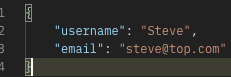

#### /auth/register/admin/
* Methods:  POST
* Arguments: None
* Description: Allows admin to create another account with admin authorisation
* Authentication: @jwt_required
* Authorisation: Admin only
* Request Body: Username, Email, Password
* Response:  
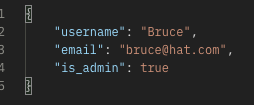

#### /auth/users/update/
* Methods:  PUT & PATCH
* Arguments: None
* Description: Allows user to update own email
* Authentication: @jwt_required
* Authorisation: User
* Request Body: Email
* Response:  
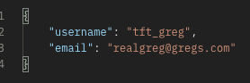

#### /auth/login/
* Methods:  POST
* Arguments: None
* Description: Allows user to login
* Authentication: None
* Authorisation: None
* Request Body: None
* Response:  
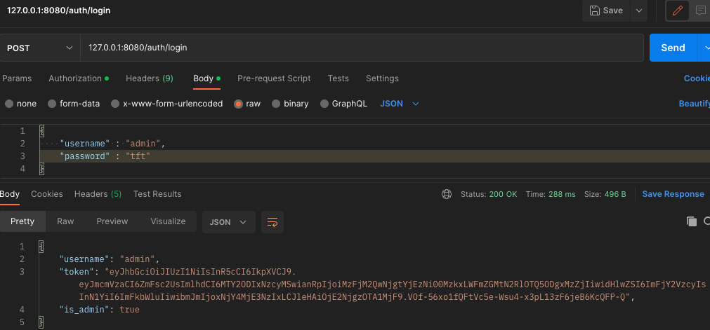

#### /auth/users/
* Methods:  GET
* Arguments: None
* Description: Allows admin to retrieve all users
* Authentication: @jwt_required
* Authorisation: Admin only
* Request Body: None
* Response:  
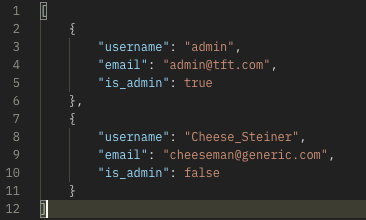

#### /auth/users/\<username>/
* Methods:  GET
* Arguments: Username
* Description: Allows admin to retrieve specific user
* Authentication: @jwt_required
* Authorisation: Admin only
* Request Body: None
* Response:  
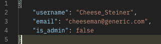  
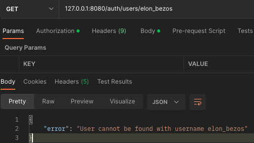

#### /auth/users/\<username>/
* Methods:  DELETE
* Arguments: Username
* Description: Allows admin to delete a specific user
* Authentication: @jwt_required
* Authorisation: Admin only
* Request Body: None
* Response:  
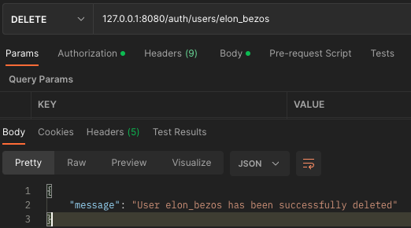  
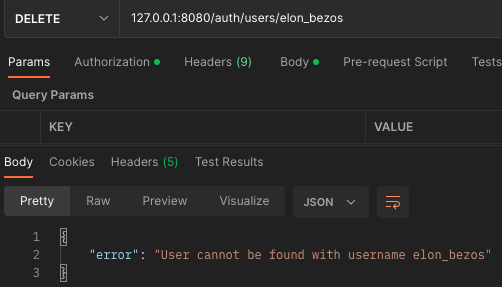

### Teamboard Data Routes:

#### /teamboards/

* Methods:  GET
* Arguments: None
* Description: Retrieves all stored Teamboards created by the logged in user
* Authentication: @jwt_required
* Authorisation: Users
* Request Body: None
* Response:  
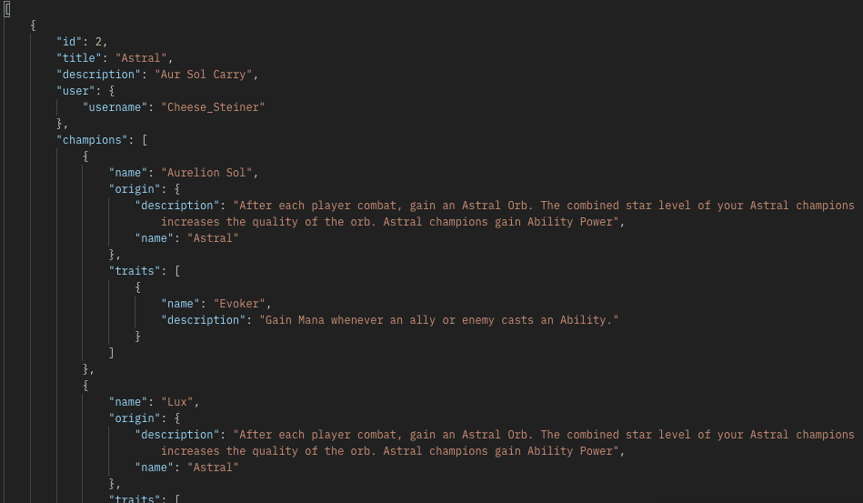

#### /teamboards/\<int:id>/

* Methods:  GET
* Arguments: Teamboard ID
* Description: Retrieves the specified teamboard if the teamboards user matches the logged in user
* Authentication: @jwt_required
* Authorisation: Users
* Request Body: None
* Response:  
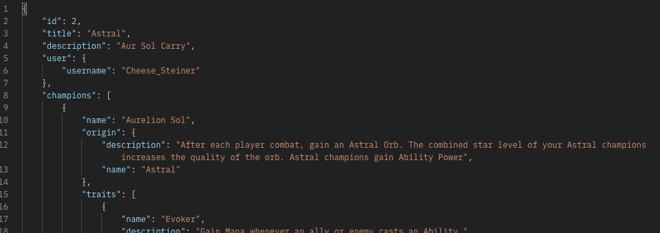

#### /teamboards/

* Methods:  POST
* Arguments: None
* Description: Creates a new teamboard setting the user as the currently logged in user
* Authentication: @jwt_required
* Authorisation: Users
* Request Body: Teamboard title and description
* Response:  
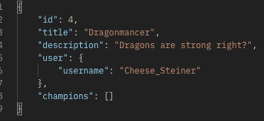

#### /teamboards/update/\<int:id>/

* Methods:  PUT & PATCH
* Arguments: Teamboard ID
* Description: Allows user to update Title and Description of one of their teamboards
* Authentication: @jwt_required
* Authorisation: Users
* Request Body: Teamboard Title and Teamboard Description
* Response:  
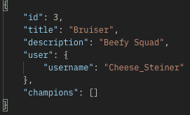

#### /teamboards/addchamp/

* Methods:  POST
* Arguments: None
* Description: Creates a new record in the teamboards and champions joining/association table. (adding a champion to a teamboard)
* Authentication: @jwt_required
* Authorisation: Users
* Request Body: Teamboard ID and Champion name (both PKs)
* Response:  
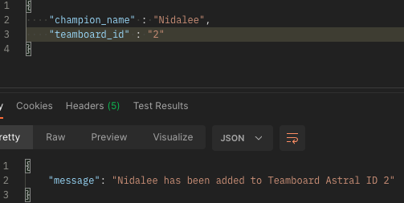

#### /teamboards/removechamp/

* Methods:  DELETE
* Arguments: None
* Description: Deletes a record in the teamboards and champions joining/association table.
* Authentication: @jwt_required
* Authorisation: Users
* Request Body: Teamboard ID and Champion name
* Response:  
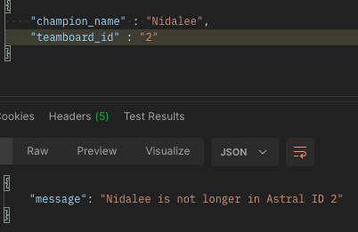

#### Champion Data Routes:

#### /champions/

* Methods:  GET
* Arguments: None
* Description: Retrieves all stored Champions details
* Authentication: None
* Authorisation: None
* Request Body: None
* Response:  
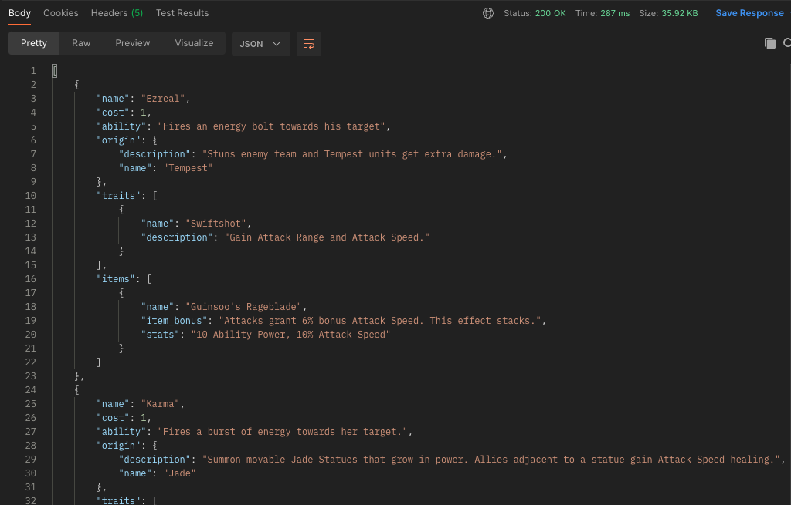

#### /champions/\<name>/

* Methods:  GET
* Arguments: Champion Name
* Description: Retrieves a specific Champions and details
* Authentication: None
* Authorisation: None
* Request Body: None
* Response:  
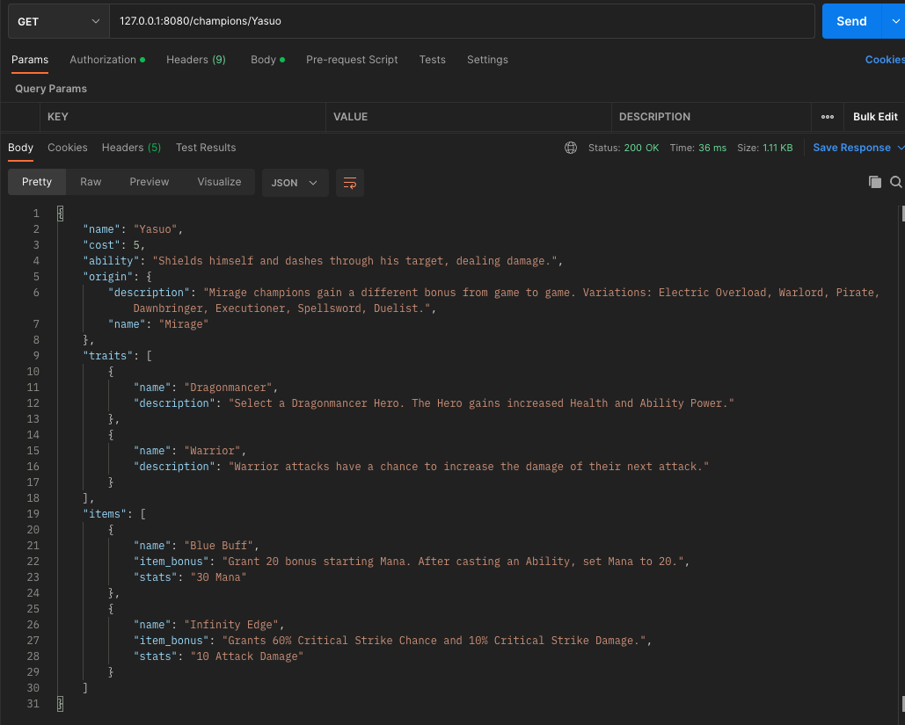

### Item Data Routes:

#### /items/

* Methods:  GET
* Arguments: None
* Description: Retrieves all stored items and details
* Authentication: None
* Authorisation: None
* Request Body: None
* Response:  
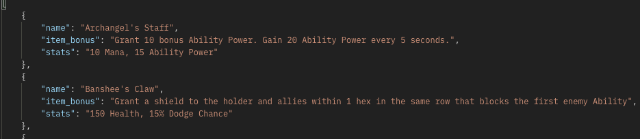

#### /items/\<name>/

* Methods:  GET
* Arguments: Item Name
* Description: Retrieves a specific items details
* Authentication: None
* Authorisation: None
* Request Body: None
* Response:  
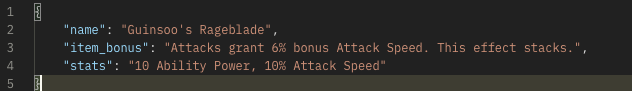

#### /items/addsuggitem/

* Methods:  POST
* Arguments: None
* Description: Creates a new record in the champions and items joining/association table. (adding a suggested item to a champion)
* Authentication: @jwt_required
* Authorisation: Admin only
* Request Body: Champion Name and Item Name
* Response:  
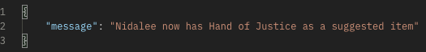

#### /items/removesuggitem/

* Methods:  DELETE
* Arguments: None
* Description: Deletes a record from the champions and items joining/association table.
* Authentication: @jwt_required
* Authorisation: Admin only
* Request Body: Champion Name and Item Name
* Response:  
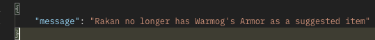

### Origins Data Routes:

#### /origins/

* Methods:  GET
* Arguments: None
* Description: Retrieves all stored origins and details
* Authentication: None
* Authorisation: None
* Request Body: None
* Response:  
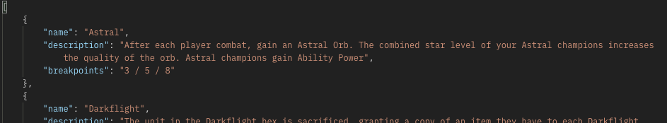

#### /origins/\<name>/

* Methods:  GET
* Arguments: Origin Name
* Description: Retrieves a specific origins details
* Authentication: None
* Authorisation: None
* Request Body: None
* Response:  
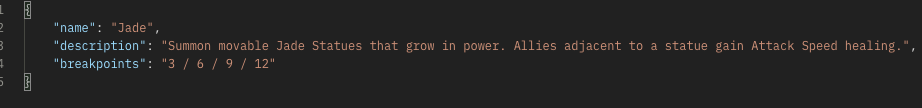

| Endpoints      | Description | HTTP Requests |
| ---------      | ------------| ------------- |
| /register      | Allows for non-admin user registration | POST |
| /register/admin | Allows for admin user registration | POST |
| /login         | Allows user to login | POST |
| /comps         | User can create a comp | POST |
| /comps/all     | User can view all of their created comps | GET |
| /comps/\<id:int>| User can view a specific comp | GET |
| /comps/\<id:int>| User can edit a specific comp | PATCH |
| /comps/\<id:int>| User can delete a specific comp | DELETE |
| /comps/stier   | User can view the S tier comps | GET |
| /champs        | User can view all champions | GET |
| /champs        | Admin can create a champion | POST |
| /champs/\<id:int>| Admin can delete a champion | DELETE |
| /traits        | User can view all traits and a description | GET |
| /traits        | Admin can create a trait | POST |
| /traits/\<id:int>| Admin can delete a trait | DELETE |
| /items         | View all items in TFT | GET |

### 6. An ERD for your app

### 7. Detail any third party services that your app will use

The following third party services were used in the application:

* Bcrypt - Allows for password hashing within your app. Hashing a password is more secure than encryption as encrypted data is a two-way street in the sense that is can be decrypted. Hashing jumples plaintext into a unique digest that can't be decrypted. Therefore, Bcrypt is a great choice when dealing with the storing of passwords in an app.
* Flask-JWT-Extended - Allows for creation of authentication tokens. This can be used to protect routes from potentially malicious users by checking a visitor has a valid token before preparing and returning any data. On top of this, authorisation was made much easier with the get_jwt_identity method which returns the users identity.  

https://www.encryptionconsulting.com/education-center/encryption-vs-hashing/
https://pypi.org/project/Flask-JWT-Extended/
https://pypi.org/project/bcrypt/

### 8. Describe your projects models in terms of the relationships they have with each other

Talk about relationships, back populates, what is displayed in each, maybe schema?

### 9. Discuss the database relations to be implemented in your application

### 10. Describe the way tasks are allocated and tracked in your project

Kanban board on Trello