## Brief Planning

### 1. Identification of the problem you are trying to solve by building this particular app

This API is being created to provide convenience when playing the Teamfight Tactics (TFT) video game especially to new players. Teamfight Tactics is a strategy game that relies on building a team that compliments itself by selecting the right units and sticking to a game plan. Being a strategy game, it isn't the most welcoming for newer and lesser experienced players who don't have a decent amount of knowledge surrounding the game.  
The game has 58 champions all with their own unique abilities. These 58 champions each have one of the 12 origins in the game and one or two of the 16 traits also in the game. There are also 36 different items that can be equipped to a champion each with unique ability and stats. All up that is a total of 112 items, champions, traits and classes that a player should be aware of while benefitting from having the knowledge of.  
Since this app is focusing on information in a game a lot of the data will need to be seeded in and not be manipulated by end users. 

The app will serve as a kind of guidebook which also allows a user to store their own compilations/teamboards (kind of like team blueprints) which they can add champions to and return all information related to these. Admins will be able to constantly update specific information within the database which will change based on the current game META (Most Effective Tactics Available).  

In the future, the app will also have an option to provide users with highly rated team comps if they would like to try new and learn new comps while returning even more information surrounding a user’s teamboard.

### 2. Why is it a problem that needs solving?

Being a strategy game, this can feel unfair to new players who lack knowledge about the workings of the game. The app endeavours to help new players who may get information overload can help them pick up the knowledge faster. Developers of these games seem to regularly admit there are a learning curves that needs to be addressed with more helpful tutorials and tools surrounding the game. Lack of knowledge is also a problem for more experienced players who may have fallen out of touch with the META. This app can provide them with important information and allow them to store teamboards they have played in the past. The more people playing the game the better experience everyone will have. More players keep competition healthy and game queue times at a minimum. Not that TFT is a dying game, but every game can always grow and finding the best way to do this is never easy. With knowledge of content being such an important aspect to enjoy a strategy game, this app can help boost positive experiences for players.

### 3. Why have you chosen this database system. What are the drawbacks compared to others?

PostgreSQL is the database management system being used in the application. It was chosen due to experience and comfort using the system. Being open source is another great positive as this means it can be used for free. It is a popular database system that is continuing to grow in popularity with time but still not as popular as some of the other systems. Because of this, many open-source apps won't support PSQL but will support its alternatives such as MYSQL. PSQL is also said to be slower than other database systems as it favours compatibility over speed. It would be very unlikely to experience any great performance issues while developing a small application such as this one.

[PostgreSQL Information Reference](https://www.guru99.com/introduction-postgresql.html#6)

### 4. Identify and discuss the key functionalities and benefits of an ORM

Object Relational Mappers (ORMs) Libraries that's key functionality is to allow developers to map and work with data in a relational database to objects. This allows for interaction with the database in an Object Orientated form. It also means developers can work with databases without having to know the specifics of how a database operates such as raw SQL commands. ORMs also give developers the power to decide how to provide a more structured way to access and manage the data within a database. Full CRUD (Create, read, update and delete) operations can be carried out on the database using the ORM. As mentioned above, the ORM allows the dev to carry these out without requiring them to know the specific syntax required to access data within the database. An example of how ORMs focus on object mapping can be seen in the below code snippets which compares an ORM select query and a native SQL select query:

#### SQLAlchemy (ORM select query)

```py
stmt = select(User, Address).join(User.addresses).order_by(User.id, Address.id)

>>> for row in session.execute(stmt):
...     print(f"{row.User.name} {row.Address.email_address}")
```

#### SQL Select query

```SQL
SELECT user_account.id, user_account.name, user_account.fullname,
address.id AS id_1, address.user_id, address.email_address
FROM user_account JOIN address ON user_account.id = address.user_id
ORDER BY user_account.id, address.id
```

Another benefit of an ORM is they are normally optimized for performance. This is achieved by the ORM determining the optimal SQL query based on the developer’s code. ORMs keep data valid and secure with built in functionality that can prevent against SQL injection attacks. This is done using the data sanitising process that is carried out behind the scenes by the ORM. It scrubs incoming data to confirm that there is no malicious or unnecessary data such as executable code or unwanted SQL queries.

[ORM Information Reference](https://docs.sqlalchemy.org/en/14/orm/queryguide.html)

### 5. Document all endpoints for your API

The endpoints of the api are listed below:

### Auth routes:

#### /auth/register/
* Methods:  POST
* Arguments: None
* Description: Allows user to register/create a login
* Authentication: None
* Authorisation: None
* Request Body: Username, Email, Password
* Response:  


#### /auth/register/admin/
* Methods:  POST
* Arguments: None
* Description: Allows admin to create another account with admin authorisation
* Authentication: @jwt_required
* Authorisation: Admin only
* Request Body: Username, Email, Password
* Response:  


#### /auth/users/update/
* Methods:  PUT & PATCH
* Arguments: None
* Description: Allows user to update own email
* Authentication: @jwt_required
* Authorisation: User
* Request Body: Email
* Response:  


#### /auth/login/
* Methods:  POST
* Arguments: None
* Description: Allows user to login
* Authentication: None
* Authorisation: None
* Request Body: None
* Response:  


#### /auth/users/
* Methods:  GET
* Arguments: None
* Description: Allows admin to retrieve all users
* Authentication: @jwt_required
* Authorisation: Admin only
* Request Body: None
* Response:  


#### /auth/users/\<username>/
* Methods:  GET
* Arguments: Username
* Description: Allows admin to retrieve specific user
* Authentication: @jwt_required
* Authorisation: Admin only
* Request Body: None
* Response:  
  


#### /auth/users/\<username>/
* Methods:  DELETE
* Arguments: Username
* Description: Allows admin to delete a specific user
* Authentication: @jwt_required
* Authorisation: Admin only
* Request Body: None
* Response:  
  


### Teamboard Data Routes:

#### /teamboards/

* Methods:  GET
* Arguments: None
* Description: Retrieves all stored Teamboards created by the logged in user
* Authentication: @jwt_required
* Authorisation: Users
* Request Body: None
* Response:  


#### /teamboards/\<int:id>/

* Methods:  GET
* Arguments: Teamboard ID
* Description: Retrieves the specified teamboard if the teamboards user matches the logged in user
* Authentication: @jwt_required
* Authorisation: Users
* Request Body: None
* Response:  


#### /teamboards/

* Methods:  POST
* Arguments: None
* Description: Creates a new teamboard setting the user as the currently logged in user
* Authentication: @jwt_required
* Authorisation: Users
* Request Body: Teamboard title and description
* Response:  


#### /teamboards/update/\<int:id>/

* Methods:  PUT & PATCH
* Arguments: Teamboard ID
* Description: Allows user to update Title and Description of one of their teamboards
* Authentication: @jwt_required
* Authorisation: Users
* Request Body: Teamboard Title and Teamboard Description
* Response:  


#### /teamboards/addchamp/

* Methods:  POST
* Arguments: None
* Description: Creates a new record in the teamboards and champions joining/association table. (adding a champion to a teamboard)
* Authentication: @jwt_required
* Authorisation: Users
* Request Body: Teamboard ID and Champion name (both PKs)
* Response:  


#### /teamboards/removechamp/

* Methods:  DELETE
* Arguments: None
* Description: Deletes a record in the teamboards and champions joining/association table.
* Authentication: @jwt_required
* Authorisation: Users
* Request Body: Teamboard ID and Champion name
* Response:  


#### Champion Data Routes:

#### /champions/

* Methods:  GET
* Arguments: None
* Description: Retrieves all stored Champions details
* Authentication: None
* Authorisation: None
* Request Body: None
* Response:  


#### /champions/\<name>/

* Methods:  GET
* Arguments: Champion Name
* Description: Retrieves a specific Champions and details
* Authentication: None
* Authorisation: None
* Request Body: None
* Response:  


### Item Data Routes:

#### /items/

* Methods:  GET
* Arguments: None
* Description: Retrieves all stored items and details
* Authentication: None
* Authorisation: None
* Request Body: None
* Response:  


#### /items/\<name>/

* Methods:  GET
* Arguments: Item Name
* Description: Retrieves a specific items details
* Authentication: None
* Authorisation: None
* Request Body: None
* Response:  


#### /items/addsuggitem/

* Methods:  POST
* Arguments: None
* Description: Creates a new record in the champions and items joining/association table. (adding a suggested item to a champion)
* Authentication: @jwt_required
* Authorisation: Admin only
* Request Body: Champion Name and Item Name
* Response:  


#### /items/removesuggitem/

* Methods:  DELETE
* Arguments: None
* Description: Deletes a record from the champions and items joining/association table.
* Authentication: @jwt_required
* Authorisation: Admin only
* Request Body: Champion Name and Item Name
* Response:  


### Origins Data Routes:

#### /origins/

* Methods:  GET
* Arguments: None
* Description: Retrieves all stored origins and details
* Authentication: None
* Authorisation: None
* Request Body: None
* Response:  


#### /origins/\<name>/

* Methods:  GET
* Arguments: Origin Name
* Description: Retrieves a specific origins details
* Authentication: None
* Authorisation: None
* Request Body: None
* Response:  


### 6. An ERD for your app

### 7. Detail any third party services that your app will use

The following third party services were used in the application:

* Bcrypt - Allows for password hashing within your app. Hashing a password is more secure than encryption as encrypted data is a two-way street in the sense that is can be decrypted. Hashing jumbles plaintext into a unique digest that can't be decrypted. Therefore, Bcrypt is a great choice when dealing with the storing of passwords in an app.
* Flask-JWT-Extended - Allows for creation of authentication tokens. This can be used to protect routes from potentially malicious users by checking a visitor has a valid token before preparing and returning any data. On top of this, authorisation was made much easier with the get_jwt_identity method which returns the users identity.  

[Encryption vs Hashing Reference](https://www.encryptionconsulting.com/education-center/encryption-vs-hashing/)
[pypy Bcrypt](https://pypi.org/project/bcrypt/)
[pypy Flask_JWT-Extended](https://pypi.org/project/Flask-JWT-Extended/)

### 8. Describe your projects models in terms of the relationships they have with each other

Looking at the ERD, the database relations from within will be discussed here.  

#### User Model and Teamboard Model Relationship

A user can create multiple teamboards but when they register a User (login) they don't require a teamboard.
A teamboard on the other hand can have one and only one user.
Therefore this relationship is a one and only one (User) to none or many (Teamboard)

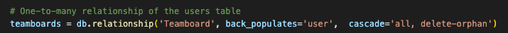
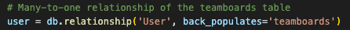

#### Teamboard Model and Champ Model Relationship

This right here is a many-to-many relationship so because of this a join table needs to be implemented. One champion can be a part of many team boards and one teamboard can contain many champions. The join table teamboard_champions is created which houses the primary keys of both champ and teamboard. The champ teamboard join table can contain one and only one teamboard key and also one and only one champion key.

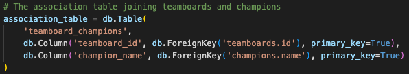

#### Champion Model and Trait Model Relationship

This relationship is another many-to-many relationship so the join table trait_champions is created. One Champion can have multiple traits and one Trait can belong to multiple Champions. Knowing the data structure of the game, it is a rule that a Champion can have one or many traits and a Trait can have one or many Champions.

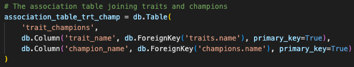

#### Champion Model and Origin Model Relationship

This relationship is a one or many (Champion) to one and only one (Origin). A Champion can have one and only one Origin, but an Origin can have one or many Champions.

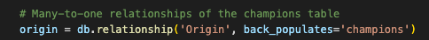
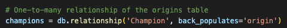

#### Champion Model and Item Model Relationship

This relationship is another many-to-many relationship therefore the association table champions_items is implemented. One Item can be suggested for zero or many Champions while a champion can have zero or many items suggested for them.

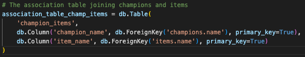

#### Schemas and Nesting

The champion schema is the biggest one in the data structure as it has the most relationships. Within the schema origins, traits, and items were nested. When a champion is viewed, either by itself or as a part of a teamboard, it will display all the required and necessary information relating to the champion.

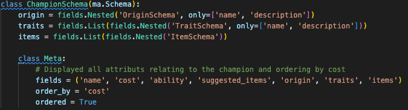

The other schema with nested data was the teamboards schema. This was because all details relating to a champion that was on a teamboard needed to be displayed.

### 9. Discuss the database relations to be implemented in your application

### Entities

#### Users

End users must first register a login (user instance) to have the ability to store teamboards. The user can create an instance by inputting personal information which gets saved in the table.

##### User Attributes:

* username, username used to login and also the primary key for User (foreign key in the teamboard table)
* email, contains the users email address
* password, contains the user’s password which is used for authentication
* is_admin, Boolean value indicating whether the user is an admin which is used for authorisation within the app

#### Teamboards

Teamboards are created by an authenticated user and must be created before champions can be added. The link to champions is through a join table which will be discussed below

##### Teamboard Attributes:

* id, primary key which is generated when the teamboard is created
* name, contains the name of the teamboard
* description, contains a description of the teamboard
* user_username, a foreign key that relates back to the user who created the teamboard

#### Champions

Champions contain all information about a champion within the game. Champions are added to teamboards by users. They have an origin, multiple traits and can have multiple suggested items. The information stored here will not be manipulated by end users except for the suggested items which can get added and removed in the champions-to-item join table below.

##### Champion Attributes:

* name, name of the champion which is the primary key
* cost, contains the cost of the champion
* ability, contains information about the champions ability
* origin_name, foreign key that relates to the origin of the champion

#### Traits

Traits relate to champions and will not be manipulatable by end users (is_admin true or false). They are joined to champions through a join table which is listed below. A champion will have one or more traits associated with themselves.

##### Trait Attributes:

* name, name of the trait which is the primary key
* description, contains a description of the trait’s bonus
* breakpoints, contains numbered breakpoints of the trait

#### Origins

Origins relate to champions and like traits will not be manipulatable by end users. They share a one-to-many relationship with champions which sees an origins name inserted as a foreign key into the champion table.

##### Origin Attributes:

* name, name of the origin which is the primary key (foreign key in the champion table)
* description, contains a description of the origin’s bonus
* breakpoints, contains numbered breakpoints of the origin

#### Items

Items are another entity that will not be added, edited or deleted by end users. The many-to-many relationship between items and champions can however be added to by an admin authorised user. These will need to be updated when stronger strategies are found or the meta of the game changes. A champion can have none or many items associated with themselves.

##### Items Attributes:

* name, name of the item which is the primary key
* description, contains a description of the item’s bonus
* stats, contains numbered breakpoints of the trait

#### Association/Join Tables

#### Teamboards and Champions

A join table that joins teamboards and champions by taking in only their primary keys to create a link. It represents a many-to many relationship where one teamboard can have zero to many champions and one champion can be a part of zero to many teamboards.

##### Teamboards and Champions Columns:

* teamboard_id, foreign key that relates to the teamboard entity
* champion_name, foreign key that relates to the champions entity

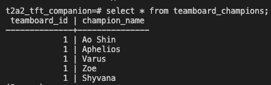

#### Traits and Champions

A join table that joins traits and champions by taking in only their primary keys to create a link. It represents a many-to many relationship where one trait can belong to one-to-many champions and one champion can have one to many traits.

##### Traits and Champions Columns:

* trait_name, foreign key that relates to the trait’s entity
* champion_name, foreign key that relates to the champions entity

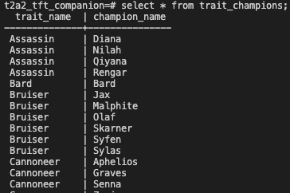

#### Champions and Items

A join table that joins champions and items by taking in only their primary keys to create a link. It represents a many-to many relationship where one champion can have zero to many suggested items and one item can be suggested for zero to many champions.

##### Champions and Items Columns:

* champion_name, foreign key that relates to the champions entity
* item_name, foreign key that relates to the items entity

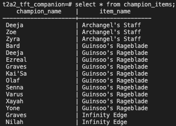

### 10. Describe the way tasks are allocated and tracked in your project

Tasks were allocated and tracked using the Agile Kanban method. This allows for updates to the app on the fly without causing issues surrounding differences to the original plan. A Kanban board was created on Trello which broke down the app into smaller individual tasks. Each task was grouped and placed into a card on the Kanban board. An example of this is the creation of routes within as an overarching category containing individual tasks:  
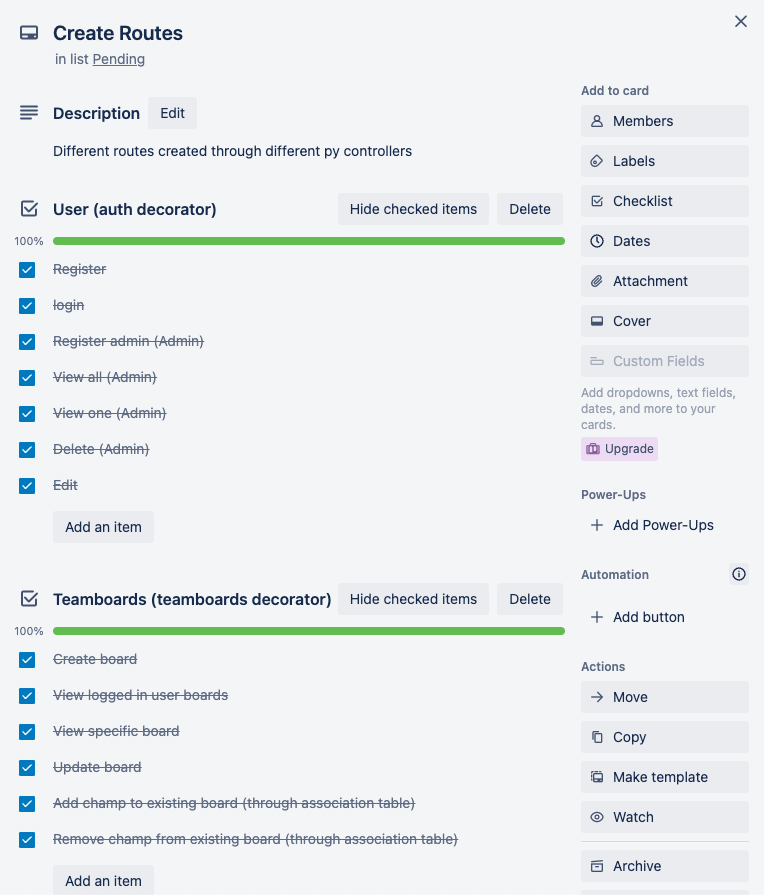  
In the above image, routes are grouped into specific parts of the app and made into checklist. Individual tasks are the checklist items and are ticked off when completed. This makes it simple to see what tasks have been completed and also what tasks are still requiring attention. 
This method has been used for all tasks including creation of the following:

* ERD
* Models
* Relationship Association/Join Tables
* Cli Commands

Click [here](https://trello.com/b/eTnyY0hK/api-webserver-project) to view the Tello board in full.

[Image of Trello Kanban Board](docs/kanban_board.png)
